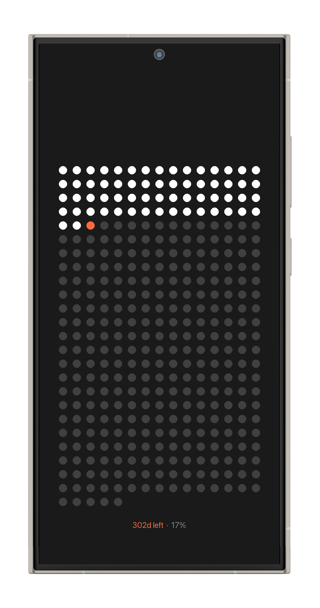
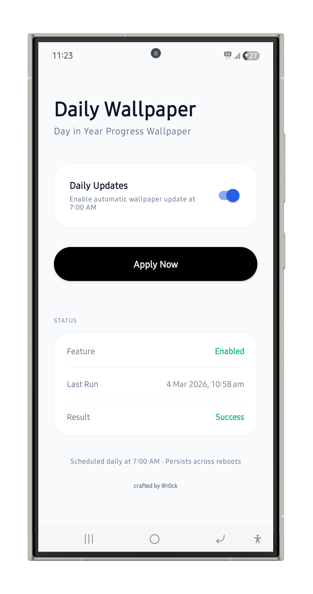

# Daily Wallpaper

An Android application that automatically updates your lock screen wallpaper daily at 7:00 AM with a dynamic "Day of the Year" progress image.

## Features
- **Dynamic Image Resolution**: Automatically detects your device's screen resolution and fetches the perfectly sized image.
- **Scheduled Updates**: Uses WorkManager to ensure the wallpaper is updated every morning, even after device reboots.
- **Manual Apply**: Option to manually trigger a wallpaper update at any time.
- **Modern UI**: Built with Material Design 3, ViewBinding, and a clean, minimal interface.
- **Robust Architecture**: Follows Clean Architecture principles using Hilt for Dependency Injection and MVVM.

## Screenshots
<p align="center">
  
  
</p>

## Tech Stack
- **Kotlin**: Primary programming language.
- **Jetpack WorkManager**: For reliable background task scheduling.
- **Hilt**: For dependency injection.
- **OkHttp**: For network requests.
- **ViewBinding**: For safe UI interaction.
- **Coroutines & Flow**: For asynchronous programming and reactive UI updates.
- **DataStore**: For lightweight data persistence.

## Download
[Latest APK ](https://github.com/Prajnadeep/DailyWallpaper/raw/main/release/app-debug.apk)

## Release
You can find the latest debug APK in the [release](./release) folder.

## Credits
Wallpapers provided by [The Life Calendar](https://thelifecalendar.com).

## How to Build
1. Clone the repository.
2. Open the project in Android Studio (Iguana or newer recommended).
3. Build and run the app on your device or emulator.

## License
```text
Copyright 2026 Daily Wallpaper

Licensed under the Apache License, Version 2.0 (the "License");
you may not use this file except in compliance with the License.
You may obtain a copy of the License at

    http://www.apache.org/licenses/LICENSE-2.0

Unless required by applicable law or agreed to in writing, software
distributed under the License is distributed on an "AS IS" BASIS,
WITHOUT WARRANTIES OR CONDITIONS OF ANY KIND, either express or implied.
See the License for the specific language governing permissions and
limitations under the License.
```
